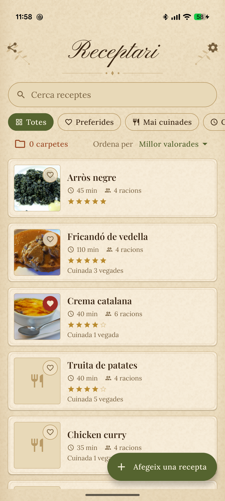
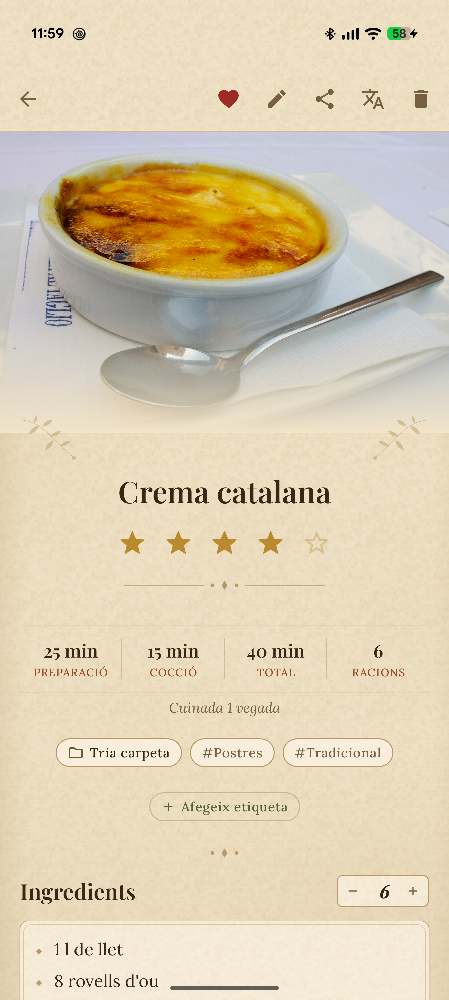
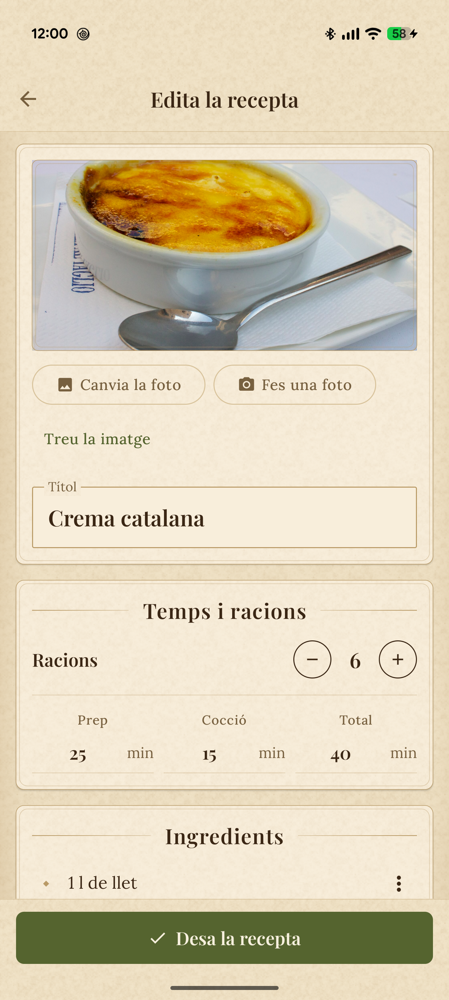
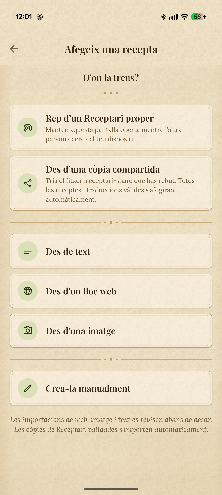
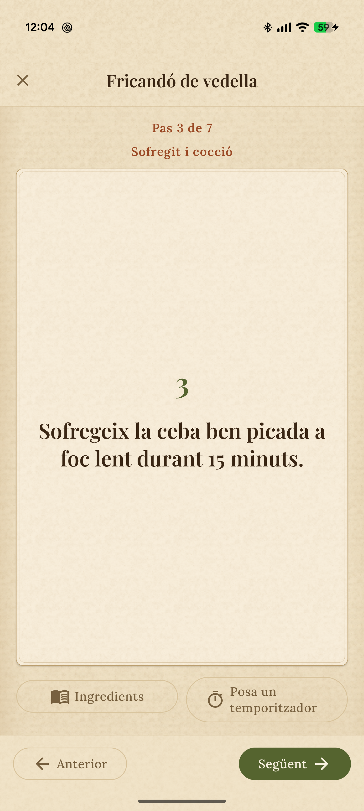

<p align="center">
  
</p>

<h1 align="center">Receptari</h1>

<p align="center">
  A private cookbook for the recipes you actually use.
  <br>
  Save them from a page, a photo, pasted text, or your own notes — then cook from one tidy recipe.
</p>

<p align="center">
  Android · Kotlin · Jetpack Compose · Catalan / Spanish / English
</p>

> **Status:** Working Android app in active development. The core recipe book, import,
> translation, cooking, backup, and private transfer flows are implemented. Accessibility
> and release polish are still in progress; there is no Play Store release yet.

## Take a look

These are captures of the real app running with fictional sample recipes and
[credited food photographs](Docs/screenshots/PHOTO_CREDITS.md).

| Library | Recipe | Edit |
|:---:|:---:|:---:|
|  |  |  |

| Import | Cook mode |
|:---:|:---:|
|  |  |

## What you can do

- **Keep one personal collection.** Create and edit recipes, add photos, organize them with
  folders and tags, find them with search and filters, and record when you cooked them.
- **Bring recipes in.** Import from a website, a photo, or pasted text. Extracted recipes
  open in the normal editor for review before they are saved. Website metadata is used
  directly when available, without an AI call.
- **Cook without rewriting a recipe.** Scale ingredient amounts for a different number of
  servings, follow one step at a time in cook mode, and run independent cooking timers.
- **Read in your language.** The interface supports Catalan, Spanish, and English. Recipe
  translations are kept as reversible display versions alongside the original wording.
- **Keep control of your data.** Recipes live on the device. Export or restore a backup,
  or send selected recipes privately to another Receptari installation.

## Designed to keep the source intact

An ingredient such as `1–2 onions` or `salt to taste` is useful even when it cannot be
fully parsed. Receptari keeps the approved original line and derives structured fields
only where it can. Serving scaling changes what is displayed, never the stored recipe.

AI helps extract and translate recipes, but an extracted import is **never saved without
review**. You supply your own Claude API key in Settings for AI features; the key is
encrypted on the device. Manual recipes and websites with usable recipe metadata work
without one. Photos or text are sent to the API only when you request an AI operation.

## Try it

You need Android Studio, an Android SDK with platform 37, and JDK 21. The app supports
Android 13 and newer (`minSdk 33`). Open the project in Android Studio, let Gradle sync,
and run the `app` configuration on a device or emulator. Set `ANDROID_HOME` or let
Android Studio create `local.properties` so Gradle can find the SDK.

Build and run the checks from a terminal:

```powershell
# Windows PowerShell
.\gradlew.bat build
```

```bash
# macOS / Linux
./gradlew build
```

You can create and use manual recipes immediately. To try AI extraction or translation,
enter your own Anthropic API key in **Settings**. The project does not ship with a key.

## Under the hood

The app is a single Android module organized into `ui`, `domain`, and `data` layers.
Its main tools are Kotlin, Jetpack Compose and Material 3, Room, Hilt, DataStore,
Coroutines/Flow, Jsoup, OkHttp, and the Anthropic SDK. The visual design uses a fixed
printed-book palette and bundled open-licensed fonts rather than dynamic system colours.

The test suite covers ingredient parsing and scaling, import and transfer logic, ViewModels,
Room DAOs, and schema migrations. GitHub Actions runs assembly, unit tests, lint, and the
Compose localization guardrail on pushes and pull requests.

This project is developed with Claude Code and Codex. Product rules and architectural
decisions are written down so agent-generated changes can be reviewed against the same
constraints as hand-written code. See [`AGENTS.md`](AGENTS.md) for those rules.

<details>
<summary>Project documentation</summary>

- [`Docs/PRD.md`](Docs/PRD.md) — product requirements
- [`Docs/ROADMAP.md`](Docs/ROADMAP.md) — progress and remaining work
- [`Docs/DECISIONS.md`](Docs/DECISIONS.md) — architecture decisions
- [`Docs/ARCHITECTURE.md`](Docs/ARCHITECTURE.md) — layers and major flows
- [`Docs/DATA_MODEL.md`](Docs/DATA_MODEL.md) — persistence model
- [`Docs/AI_INTEGRATION.md`](Docs/AI_INTEGRATION.md) — extraction, translation, and key handling
- [`Docs/CONVENTIONS.md`](Docs/CONVENTIONS.md) — code and localization conventions

</details>
